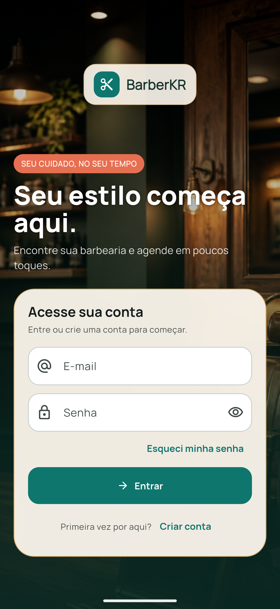
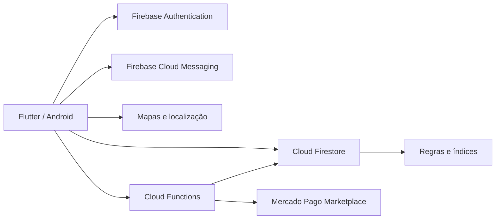

<div align="center">
  
  <h1>BarberKR</h1>
  <p><strong>Agendamento inteligente e gestão de rotina para barbearias.</strong></p>

  [](https://flutter.dev/)
  [](https://dart.dev/)
  [](https://firebase.google.com/)
  [](https://developer.android.com/)
  [](https://github.com/KennnedyRamos/agendamento-app/actions/workflows/ci.yml)
  [](LICENSE)
</div>


---

## ✨ Sobre o projeto

O **BarberKR** é uma aplicação mobile construída em Flutter para conectar clientes e barbearias em uma experiência única de descoberta, agendamento e atendimento. O cliente encontra estabelecimentos próximos, consulta horários, conversa com a barbearia e acompanha seus agendamentos. O barbeiro recebe uma visão operacional do dia, administra serviços, planos, disponibilidade e histórico.

Mais do que uma demonstração visual, este projeto explora problemas reais de produto: concorrência na reserva do mesmo horário, identidade de quem cancelou, comunicação individual, notificações persistentes, privacidade, pagamentos marketplace e preparação de releases assinados.

> 🚀 Projeto de portfólio desenvolvido por **Kennedy Ramos**, com foco em engenharia mobile, experiência do usuário e evolução contínua de produto.

## 🎯 Destaques

- Dois perfis no mesmo aplicativo: **cliente** e **barbeiro**.
- Reserva transacional: um horário não pode ser ocupado por dois clientes.
- Painel diário com próximos atendimentos e atividades recentes.
- Agenda e histórico separados, com pesquisa por cliente e filtros por período.
- Cancelamento rastreável por autor, motivo e data.
- Chat individual com histórico e notificações não lidas.
- Descoberta de barbearias próximas, com consentimento de localização.
- Logo personalizada por barbearia e identidade visual moderna.
- Pagamento em dinheiro ativo e integração marketplace com Mercado Pago preparada.
- Regras de segurança, CI, testes e assinatura de release para Android.

## 📱 Experiência por perfil

<p align="center">
  
</p>

### Cliente

- Cadastro, login e recuperação de senha com Firebase Authentication.
- Busca por nome, bairro ou cidade.
- Sugestões ordenadas por proximidade; a localização do cliente não é persistida.
- Perfil público da barbearia, serviços, preços, avaliações e rotas.
- Consulta de horários e agendamento com pagamento no local.
- Planos mensais com recorrência de horários.
- Histórico de atendimentos confirmados.
- Avaliação da barbearia após o atendimento.
- Chat e central de notificações.

### Barbeiro

- Dashboard de rotina com total do dia, próximo horário e indicadores.
- Atividades recentes limitadas aos cinco eventos mais relevantes.
- Agenda operacional e conclusão de atendimentos.
- Histórico com filtros por dia, mês ou ano, nome do cliente e tipo de evento.
- Cadastro de serviços, preços, planos, endereço, localização e horários.
- Personalização da logo exibida aos clientes.
- Conversas individuais e notificações de agendamento, cancelamento e pagamento.
- Conexão de uma conta Mercado Pago por barbearia, quando o backend estiver publicado.

## 🧠 Decisões de engenharia



| Tema | Solução aplicada |
|---|---|
| Concorrência de horários | Transação atômica entre `appointments` e `slots` |
| Segurança | Regras com campos permitidos, identidade imutável e validação de participantes |
| Pagamentos | Preço validado no servidor, OAuth por estabelecimento e webhook assinado |
| Tokens OAuth | Criptografia AES-256-GCM antes de persistir |
| Notificações | Push em primeiro plano + histórico por usuário + contador de não lidas |
| Privacidade | Consentimento contextual de localização e links legais dentro do app |
| Release Android | Chave privada fora do Git, R8 e bloqueio de fallback para assinatura debug |
| Qualidade | `flutter analyze`, testes automatizados e workflow de CI |

## 🛠️ Stack

- **Flutter / Dart** — interface e regras de apresentação.
- **Firebase Authentication** — contas e sessões.
- **Cloud Firestore** — perfis, barbearias, agenda, chat, avaliações e notificações.
- **Firebase Cloud Messaging** — notificações push.
- **Cloud Functions for Firebase** — eventos e backend seguro de pagamentos.
- **Mercado Pago Marketplace** — Pix e cartão direcionados à conta de cada barbearia.
- **Geolocator + OpenStreetMap** — proximidade, geocodificação e apoio à navegação.
- **GitHub Actions** — análise, testes e validação das funções.

## 🗂️ Organização

```text
lib/
├── app/
│   ├── models/       # Entidades e conversões de dados
│   ├── screens/      # Fluxos de cliente, barbeiro, chat e checkout
│   ├── services/     # Firebase, agenda, mensagens, notificações e pagamentos
│   ├── utils/        # Disponibilidade, cancelamento e mapas
│   └── widgets/      # Componentes reutilizáveis
└── main.dart         # Inicialização das integrações

functions/            # Backend Firebase e Mercado Pago
docs/                 # Privacidade, publicação e configuração
scripts/              # Execução e geração de releases
test/                 # Testes unitários e de widgets
```

## 🚀 Executando localmente

### Pré-requisitos

- Flutter **3.38.5** ou uma versão estável compatível.
- Android Studio com Android SDK **36**.
- Um emulador Android ou dispositivo físico.
- JDK 17 ou superior para o build Android.
- Firebase CLI e JDK 21+ apenas para validar regras no emulador local.

### 1. Clone e dependências

```powershell
git clone https://github.com/KennnedyRamos/agendamento-app.git
cd agendamento-app
flutter pub get
```

### 2. Firebase

O repositório inclui a configuração pública do cliente Firebase usada na demonstração Android. Como essas chaves também ficam presentes no APK, a proteção dos dados é feita por Authentication, regras do Firestore e restrições de API. Para trabalhar em um ambiente isolado, crie ou selecione seu próprio projeto, habilite **Authentication por e-mail/senha**, **Cloud Firestore** e **Cloud Messaging**, e então reconfigure o aplicativo:

```powershell
dart pub global activate flutterfire_cli
flutterfire configure
```

Confirme que o arquivo foi criado em:

```text
android/app/google-services.json
```

Para publicar as regras e os índices no projeto selecionado:

```powershell
firebase deploy --only firestore
```

### 3. Emulador

```powershell
flutter emulators
flutter emulators --launch Pixel_7_Pro
flutter devices
flutter run -d emulator-5554
```

Se aparecer `INSTALL_FAILED_INSUFFICIENT_STORAGE`, abra **Android Studio → Device Manager → menu do emulador → Wipe Data** e inicie o dispositivo novamente.

## ✅ Qualidade e testes

```powershell
dart format --set-exit-if-changed lib test
flutter analyze
flutter test
node --check functions/index.js
node --check functions/mercado_pago.js
```

Os testes cobrem disponibilidade, identificação do responsável pelo cancelamento, IDs estáveis de conversa, prioridade da logo e contador de notificações.

## 💳 Mercado Pago

O agendamento com **Dinheiro — pagar no local** funciona independentemente da conexão de pagamentos. Pix e cartão usam uma arquitetura marketplace: cada barbearia autoriza a própria conta, e o backend cria o checkout com o preço obtido do cadastro no Firestore.

As Cloud Functions exigem um projeto Firebase no plano **Blaze** para publicação. Enquanto o backend não estiver publicado, o aplicativo mantém automaticamente a alternativa de pagamento no local. Consulte o guia completo em [docs/mercado_pago_setup.md](docs/mercado_pago_setup.md).

## 📦 Release Android

Nunca use uma chave debug em produção. Gere uma chave de upload local e faça backup dos arquivos privados:

```powershell
.\scripts\create_upload_keystore.ps1
.\scripts\build_release.ps1
```

Saídas esperadas:

```text
build/app/outputs/flutter-apk/app-release.apk
build/app/outputs/bundle/release/app-release.aab
```

O **AAB** é o artefato para a Play Store; o **APK** é útil para instalação direta e homologação. Veja o checklist em [docs/PLAY_STORE_RELEASE.md](docs/PLAY_STORE_RELEASE.md).

## 🔐 Privacidade e segurança

- [Política de privacidade](docs/PRIVACY_POLICY.md)
- [Exclusão de conta e dados](docs/ACCOUNT_DELETION.md)
- [Política de segurança do repositório](SECURITY.md)

Arquivos realmente sensíveis, como `key.properties`, keystores, tokens OAuth e segredos do backend, permanecem fora do controle de versão. As configurações públicas dos clientes Firebase não concedem acesso administrativo e continuam protegidas pelas regras versionadas neste projeto.

## 🧭 Status e próximos passos

| Entrega | Status |
|---|---|
| Fluxos de cliente e barbeiro | ✅ Implementado |
| Agenda, histórico e cancelamentos | ✅ Implementado |
| Chat e notificações no app | ✅ Implementado |
| Descoberta por proximidade | ✅ Implementado |
| Dinheiro no local | ✅ Implementado |
| Mercado Pago Marketplace | 🟡 Código pronto; publicação das Functions pendente do plano Blaze |
| Release Android assinado | ✅ Automatizado |
| Publicação na Play Store | 🟡 Requer conta do desenvolvedor, ficha da loja e envio manual do AAB |

Próximas evoluções possíveis: testes de integração com Firebase Emulator Suite, paginação de históricos extensos, observabilidade de produção e painel web administrativo.

## 🤝 Contribuição

Issues e pull requests são bem-vindos. Antes de enviar uma alteração, execute a suíte de qualidade e descreva o impacto no fluxo de cliente e/ou barbeiro.

## 📄 Licença

Distribuído sob a licença MIT. Consulte [LICENSE](LICENSE).

## 👨‍💻 Autor

**Kennedy Ramos**

- [GitHub](https://github.com/KennnedyRamos)
- [LinkedIn](https://www.linkedin.com/in/kennedy-silva-ramos-566b00150/)
- [Portfólio](https://kennnedyramos.github.io/)

---

<div align="center">
  Feito com Flutter, Dart e dedicação por Kennedy Ramos. 🚀
</div>
